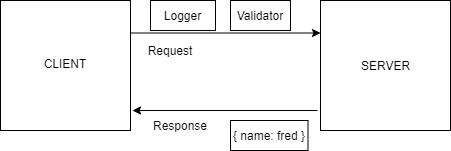

# LAB - Class 02 - basic-express-server

## Project: Express

### Author: Stacy Burris 

### Links and Resources

### Setup

`.env` requirements
  + `PORT` - 3000

### How to initialize/run your application

npm start (or) nodemon

+ Endpoint: /person

  + /person?name=<enter name here>

### How to use your library

**Tests**

How do you run tests?

+ You can run this test in terminal by running npm test

UML

+ 